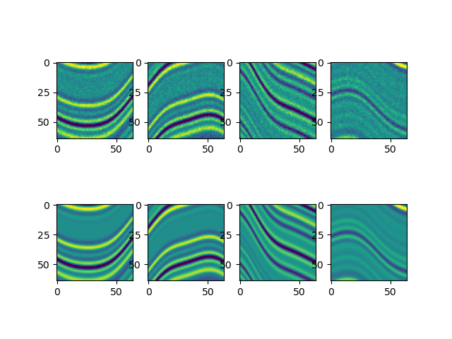
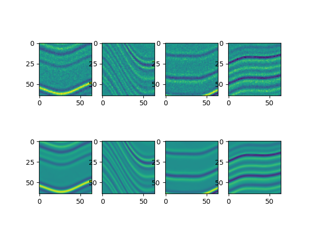

# 深度学习地震勘探入门

## 简介

我们在论文中提供了一个例子，但是由于数据不容易下载，很多同学没有测试成功，这个帖子中我们将这个例子进行了详细注释，同时提供手把手教学，数据也上传到了百度网盘。如果大家觉得有用，就引用我们的文章吧。

文章引用：S. Yu, J. Ma*, Deep learning for geophysics: current and future trends, Reviews of Geophysics, 2021, 59 (3), e2021RG000742.

数据下载链接：链接：https://pan.baidu.com/s/1pS3ap4IUg2Zi5hcEwZldCw  提取码：zs8k （800M）

Gitee代码链接：https://gitee.com/sevenysw/deep-learning-geophysics

论文中的代码仅用15行（核心代码，不包括可视化）就实现了数据的加载，训练和测试（不包括训练数据的生成），我们选择使用Keras来实现这样紧凑结构的框架。Keras是TensorFlow、Theano等框架的高级封装。Keras的安装有两种简单的方法，第一种是安装tensorflow，通过tf.keras来调用（本代码的情况）；第二种是分别安装tensorflow和keras，可以直接通过keras来调用。

## 测试的环境配置

环境1：

显卡：Nvidia 1080Ti，驱动版本496.13

软件：Windows 10，Cuda 10.0，VSCode 1.62.2，tensorflow_gpu 1.15.0 (或者2.1.0)，python3.7

环境2：

参考Issue

显卡：Nvidia 3080Ti，驱动版本470.86

软件：Ubuntu 18.04, Cuda 11.0, tensorflow_gpu 2.6.1, python 3.6.13, conda 4.11.0

1，修改code.py为其它名字

2，pip uninstall keras

pip install keras==2.6.0

该程序对不同环境的容忍度比较大，所以不必完全一样。

## 环境配置步骤

### 1，python环境管理软件

安装anaconda:https://www.anaconda.com/products/individual

### 2，找到所需cuda安装，比如10.0:

https://developer.nvidia.com/cuda-10.0-download-archive

### 3，创建虚拟环境

conda可以配置源，加速下载包，https://mirror.tuna.tsinghua.edu.cn/help/anaconda/ 

在命令行cmd（ubuntu中为terminal）中运行

```
conda create -n tfv2 python=3.7
```

开启虚拟环境 

```
conda activate tfv2
```

### 4，安装tensorflow

在安装之前可以切换源:https://blog.csdn.net/afeiqiang/article/details/108257584 

加速安装，而且更稳定

Windows用户：c:\Users\你的用户名\pip\pip.ini，没有就新建一个，

Linux用户：修改 ~/.pip/pip.conf 文件，没有就新建一个，写入以下内容：

```
[global]
index-url = http://mirrors.aliyun.com/pypi/simple/ *# 根据需要选清华源或者阿里源*
[install]
trusted-host=mirrors.aliyun.com
```

安装依赖包numpy, matplotlib：

```
pip install numpy matplotlib
```

然后开始安装：

```
pip install --upgrade tensorflow_gpu
```

如若要指定版本，则可以用

```
pip install --upgrade tensorflow_gpu==2.1.0
```

### 5，下载代码

git clone https://gitee.com/sevenysw/deep-learning-geophysics.git

修改code.py 中noise_dataset.h5的绝对目录位置

运行代码：

```
python code.py
```

不出意外，代码就可以正常运行了，整个过程在1080ti下大概要25分钟（共50次迭代）。

## 代码说明

```python
#加载相关用到的包
import h5py
import matplotlib.pyplot as plt
from tensorflow.keras.layers import Input,Conv2D,BatchNormalization,ReLU,Subtract
from tensorflow.keras.models import Model
#数据读取，关于noise_dataset.h5的生成方法，我们在最后说明
ftrain = h5py.File(r'E:\Datasets\noise_dataset.h5','r')
#从h5py转换成numpy格式，numpy格式keras是可以直接处理的
#X，Y的维度为(12800,64,64,1)，11800个训练样本，1000个测试样本
#X 为含噪数据，Y为干净数据
X, Y=ftrain['/X'][()],ftrain['/Y'][()]
#训练样本的展示
for i in range(4):
    plt.subplot(2,4,i+1);plt.imshow(X[i,:,:,0],vmin=-2,vmax=2)
    plt.subplot(2,4,i+5);plt.imshow(Y[i,:,:,0],vmin=-2,vmax=2)
plt.show()
#创建神经网络，初始化输入维度，建立输入输出的关系，整个过程使用“符号化”的表示方法
#使用卷积神经网络，3x3的卷积核，共17个卷积层，使用了BN层
input = Input(shape=(None,None,1)) #输入层
x=Conv2D(64,3,padding='same',activation='relu')(input) #卷积层
for i in range(15):
    x= Conv2D(64,3,padding='same',use_bias = False)(x) #卷积层
    x= ReLU()(BatchNormalization(axis=3,momentum=0.0,epsilon=0.0001)(x)) #ReLU和BN层 
x= Conv2D(1,3,padding='same',use_bias = False)(x) #最后一层卷积层
#建立输入与输出关系的网络，注意此时使用的输出为输入与输出之差，即学习残差
model = Model(inputs=input,outputs=Subtract()([input,x])) 
#给定损失函数MSE，优化算法RMSprop
model.compile(optimizer="rmsprop",loss="mean_squared_error")
#开始进行训练，每次使用32个样本，全部循环50次，每次训练样本打乱数据
model.fit(X[:-1000],Y[:-1000],batch_size=32,epochs=50,shuffle=True)
#进行测试
Y_ = model.predict(X[-1000:])
#训练结果的可视化
for i in range(4):
    plt.subplot(2,4,i+1);plt.imshow(X[-1000+i,:,:,0],vmin=-2,vmax=2)
    plt.subplot(2,4,i+5);plt.imshow(Y_[i,:,:,0],vmin=-2,vmax=2)
plt.show()
```

训练数据如下：



预测结果如下：



## 训练数据

训练数据的生成基本思路就是利用Matlab的h5write函数将数组转换成h5格式，需要注意的是数组维度的排序，Matlab和python是有一些区别的。

另外我们将数据生成和网络训练都写到一起，使用pytorch，在https://github.com/sevenysw/python_segy

